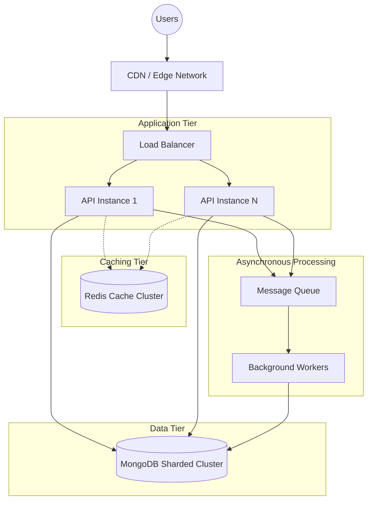

# High-Level Architecture Diagram

```mermaid
flowchart TD
    Users((Users)) --> CDN[CDN / Edge Network]
    CDN --> LB[Load Balancer]
    
    subgraph "Application Tier"
        LB --> API1[API Instance 1]
        LB --> API2[API Instance N]
    end
    
    subgraph "Caching Tier"
        API1 -.-> Redis[(Redis Cache Cluster)]
        API2 -.-> Redis
    end
    
    subgraph "Data Tier"
        API1 --> MongoDB[(MongoDB Sharded Cluster)]
        API2 --> MongoDB
    end
    
    subgraph "Asynchronous Processing"
        API1 --> Queue[Message Queue]
        API2 --> Queue
        Queue --> Worker[Background Workers]
        Worker --> MongoDB
    end
```
